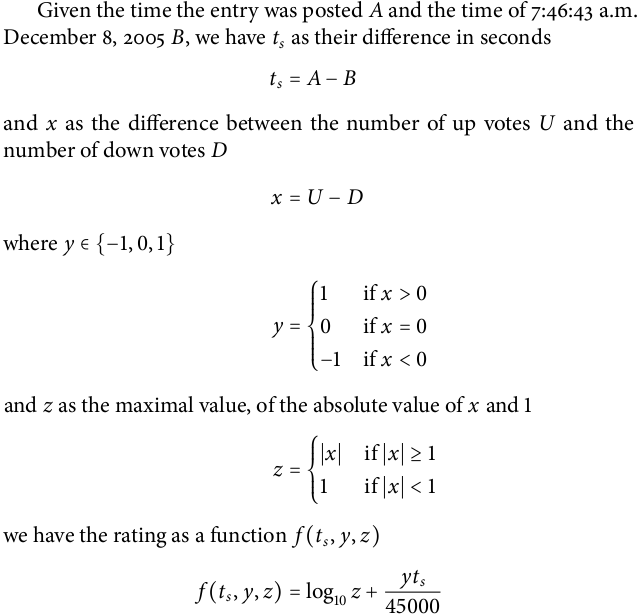

# News Feed

A news feed for your social networking application
* Users can create Posts which are shared with followers
* Posts can contain text and media
* Users can also like and comment on a post
* News Feed of followers are created when user creates a post
* Ranking of posts in feed is based on parameters such as : Likes count, Comments count, time of post and distance of post from user.

  
API Docs - http://jatin.work/#/news-feed/swagger-ui

Postman Collection - https://www.postman.com/warped-crater-862837/workspace/news-feed/collection/13803448-95027502-7e8c-45b1-8c7a-3faf165d7815

## High Level Diagram

## Ranking Algorithm
* Inspired by Reddit's [hot algorithm](https://medium.com/hacking-and-gonzo/how-reddit-ranking-algorithms-work-ef111e33d0d9)
* As time goes by, newer posts will have a higher score.
* Number of likes and comments have a logarithmic effect on score
* Here, `y` is always positive

## Database Schema

## Environment Variables
* MYSQL_PASSWORD
* NEO4J_PASSWORD
* AWS_ACCESS_KEY_ID
* AWS_SECRET_ACCESS_KEY
* AWS_DEFAULT_REGION
